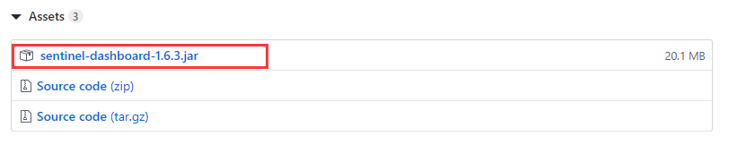
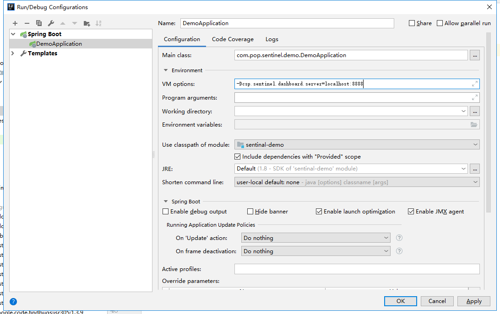
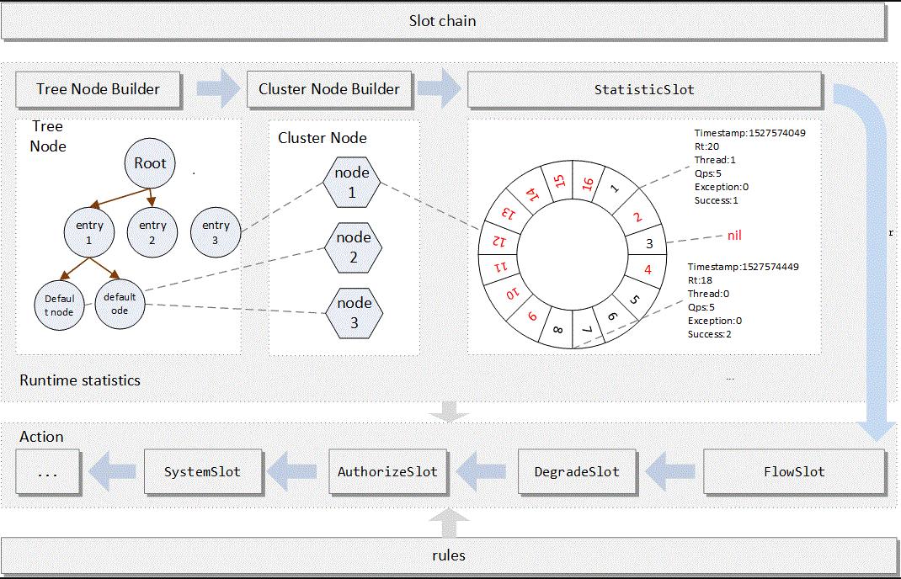

# Sentinel-Demo

一种提供分布式限流的解决方案。

* 限流只是一个最基本的服务治理/服务质量体系要求
  * 流量的切换
  * 能不能够正对不同的渠道设置不同的限流策略
  * 流量的监控
  * 熔断
  * 动态限流
  * 集群限流
  * ....
* 承接过双十一、实时监控。

具体使用。

https://github.com/alibaba/Sentinel/wiki/%E4%BB%8B%E7%BB%8D

引入jar包

```xml
 <dependency>
            <groupId>com.alibaba.csp</groupId>
            <artifactId>sentinel-core</artifactId>
            <version>1.6.3</version>
        </dependency>
```

首先构建规则，也就是限流的规则，例如之前的单机guava限制了每秒生成10个令牌。对于sentinel也是一样，我们需要初始化规则。

* 初始化限流规则
* 根据限流规则进行限流

```java
public class SentinelDemo {

    private static void initFlowRules(){
        List<FlowRule> rules = new ArrayList<>();
        FlowRule flowRule = new FlowRule();
        flowRule.setResource("doTest");//资源，被保护的，一般是方法或者接口；
        flowRule.setGrade(RuleConstant.FLOW_GRADE_QPS);//限流的阈值类型，这里有两种，一种是qps，一种是线程数
        flowRule.setCount(10);//表示数量
        rules.add(flowRule);
        FlowRuleManager.loadRules(rules);
    }

    public static void main(String[] args) {//限流的实施
        initFlowRules();
        while(true){
            Entry entry = null;//资源的实体
            try {
                entry = SphU.entry("doTest");
                System.out.println("Hello Pop");
            }catch (BlockException e){//如果被限流，将会抛出这个异常
                e.printStackTrace();
            }finally {
                if(entry!=null){
                    entry.exit();//释放
                }
            }

        }
    }

}
```

我们可以启动控制台去查看，前往官网的有realease的内容。



启动参数

```
java -jar -Dserver.port=8888 -Dcsp.sentinel.dashboard.server=localhost:8888 -Dproject.name=sentinel-dashboard xxx.jar
```

由于这是一个监控的平台，所以我们将这个刚刚创建好的服务加入到dashborad监控中去



并且监控还需要引入额外的jar包

```xml
<dependency>
            <groupId>com.alibaba.csp</groupId>
            <artifactId>sentinel-transport-simple-http</artifactId>
            <version>1.6.3</version>
        </dependency>
```

### Sentinel 限流的思考

* 限流用了什么算法来实现（滑动窗口）
* 它是怎么实现的（责任链有关系）
* SPI的扩展


### 基于注解方式实现

切面需要引入这个依赖

```xml
<dependency>
            <groupId>com.alibaba.csp</groupId>
            <artifactId>sentinel-annotation-aspectj</artifactId>
            <version>1.6.3</version>
        </dependency>
```

```java
@RestController
public class SentinelController {

    /**
     * 针对方法级别的限流
     * @return
     */
    @SentinelResource(value = "syayHello")
    public String sayHello(){
        System.out.println("hello world");
        return "hello world";
    }

}
```

但是由于需要切面拦截，所以我们还需要写一个切面的bean，提供给spring

```java
@Configuration
public class ApoConfiguration {

    @Bean
    public SentinelResourceAspect sentinelResourceAspect(){
        return new SentinelResourceAspect();
    }

}
```

制定规则。

```java
public class DemoApplication {

    public static void main(String[] args) {
        initFlowRules();
        SpringApplication.run(DemoApplication.class, args);
    }

    //初始化规则
    private static void initFlowRules(){
        List<FlowRule> rules = new ArrayList<>();
        FlowRule flowRule = new FlowRule();
        flowRule.setResource("doTest");//资源，被保护的，一般是方法或者接口；
        flowRule.setGrade(RuleConstant.FLOW_GRADE_QPS);//限流的阈值类型，这里有两种，一种是qps，一种是线程数
        flowRule.setCount(10);//表示数量
        rules.add(flowRule);
        FlowRuleManager.loadRules(rules);
    }
}

```

### Sentinel源码的解读

Sentinel的限流算法基于滑动窗口，但是其实本质实现的手法并不负责，他将时间切割成一个又一个可以看做是窗口的区域，并通过开始时间和结束时间来计算当前的窗口索引，并是否落到了当前的窗口上，如果落到了，就返回当前窗口，如果发现计算出来的时间大于了当前窗口表示，当前窗口已经过期，需要将窗口后移。

同时，Sentinel将所有被定义成Resource的资源，纳入自己的管辖范围之内，然后将所有的资源拼凑成树节点，这很好理解，文件中的资源系统就是一个一个的树节点。

当请求过来的时候，会通过他们组成链路的一个一个考验，这个链路的前半段是一些容错的检测，中间的轮盘表示



他的算法的具体验，也就是滑动窗口的具体体验，每一个滑动窗口都会记录自己开始时间和结束时间，并且会记录这个滑动窗口进入请求的次数。

然后就是FlowSlot，我们之前定义的规则，我们要规定这个请求是否符合我们制定的规则，如果不符合，我们会用我们的方式将这个请求如何处理。后面则是一连串的请求方式

```java
public class DefaultSlotChainBuilder implements SlotChainBuilder {

    @Override
    public ProcessorSlotChain build() {
        ProcessorSlotChain chain = new DefaultProcessorSlotChain();
        chain.addLast(new NodeSelectorSlot());
        chain.addLast(new ClusterBuilderSlot());
        chain.addLast(new LogSlot());
        chain.addLast(new StatisticSlot());
        chain.addLast(new SystemSlot());
        chain.addLast(new AuthoritySlot());
        chain.addLast(new FlowSlot());
        chain.addLast(new DegradeSlot());

        return chain;
    }

}
```

