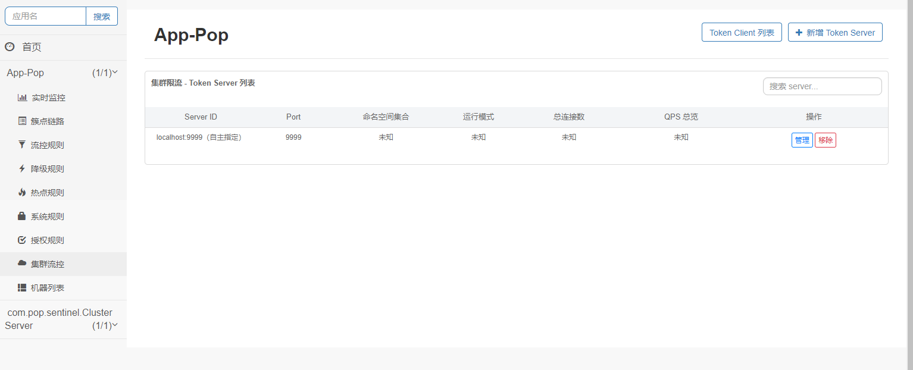

# Sentinel-Demo

一种提供分布式限流的解决方案。

* 限流只是一个最基本的服务治理/服务质量体系要求
  * 流量的切换
  * 能不能够正对不同的渠道设置不同的限流策略
  * 流量的监控
  * 熔断
  * 动态限流
  * 集群限流
  * ....
* 承接过双十一、实时监控。

具体使用。

https://github.com/alibaba/Sentinel/wiki/%E4%BB%8B%E7%BB%8D

引入jar包

```xml
 <dependency>
            <groupId>com.alibaba.csp</groupId>
            <artifactId>sentinel-core</artifactId>
            <version>1.6.3</version>
        </dependency>
```

首先构建规则，也就是限流的规则，例如之前的单机guava限制了每秒生成10个令牌。对于sentinel也是一样，我们需要初始化规则。

* 初始化限流规则
* 根据限流规则进行限流

```java
public class SentinelDemo {

    private static void initFlowRules(){
        List<FlowRule> rules = new ArrayList<>();
        FlowRule flowRule = new FlowRule();
        flowRule.setResource("doTest");//资源，被保护的，一般是方法或者接口；
        flowRule.setGrade(RuleConstant.FLOW_GRADE_QPS);//限流的阈值类型，这里有两种，一种是qps，一种是线程数
        flowRule.setCount(10);//表示数量
        rules.add(flowRule);
        FlowRuleManager.loadRules(rules);
    }

    public static void main(String[] args) {//限流的实施
        initFlowRules();
        while(true){
            Entry entry = null;//资源的实体
            try {
                entry = SphU.entry("doTest");
                System.out.println("Hello Pop");
            }catch (BlockException e){//如果被限流，将会抛出这个异常
                e.printStackTrace();
            }finally {
                if(entry!=null){
                    entry.exit();//释放
                }
            }

        }
    }

}
```

我们可以启动控制台去查看，前往官网的有realease的内容。


启动参数

```
java -jar -Dserver.port=8888 -Dcsp.sentinel.dashboard.server=localhost:8888 -Dproject.name=sentinel-dashboard xxx.jar
```

由于这是一个监控的平台，所以我们将这个刚刚创建好的服务加入到dashborad监控中去


并且监控还需要引入额外的jar包

```xml
<dependency>
            <groupId>com.alibaba.csp</groupId>
            <artifactId>sentinel-transport-simple-http</artifactId>
            <version>1.6.3</version>
        </dependency>
```

### Sentinel 限流的思考

* 限流用了什么算法来实现（滑动窗口）
* 它是怎么实现的（责任链有关系）
* SPI的扩展


### 基于注解方式实现

切面需要引入这个依赖

```xml
<dependency>
            <groupId>com.alibaba.csp</groupId>
            <artifactId>sentinel-annotation-aspectj</artifactId>
            <version>1.6.3</version>
        </dependency>
```

```java
@RestController
public class SentinelController {

    /**
     * 针对方法级别的限流
     * @return
     */
    @SentinelResource(value = "syayHello")
    public String sayHello(){
        System.out.println("hello world");
        return "hello world";
    }

}
```

但是由于需要切面拦截，所以我们还需要写一个切面的bean，提供给spring

```java
@Configuration
public class ApoConfiguration {

    @Bean
    public SentinelResourceAspect sentinelResourceAspect(){
        return new SentinelResourceAspect();
    }

}
```

制定规则。

```java
public class DemoApplication {

    public static void main(String[] args) {
        initFlowRules();
        SpringApplication.run(DemoApplication.class, args);
    }

    //初始化规则
    private static void initFlowRules(){
        List<FlowRule> rules = new ArrayList<>();
        FlowRule flowRule = new FlowRule();
        flowRule.setResource("doTest");//资源，被保护的，一般是方法或者接口；
        flowRule.setGrade(RuleConstant.FLOW_GRADE_QPS);//限流的阈值类型，这里有两种，一种是qps，一种是线程数
        flowRule.setCount(10);//表示数量
        rules.add(flowRule);
        FlowRuleManager.loadRules(rules);
    }
}

```

### Sentinel源码的解读

Sentinel的限流算法基于滑动窗口，但是其实本质实现的手法并不负责，他将时间切割成一个又一个可以看做是窗口的区域，并通过开始时间和结束时间来计算当前的窗口索引，并是否落到了当前的窗口上，如果落到了，就返回当前窗口，如果发现计算出来的时间大于了当前窗口表示，当前窗口已经过期，需要将窗口后移。

同时，Sentinel将所有被定义成Resource的资源，纳入自己的管辖范围之内，然后将所有的资源拼凑成树节点，这很好理解，文件中的资源系统就是一个一个的树节点。

当请求过来的时候，会通过他们组成链路的一个一个考验，这个链路的前半段是一些容错的检测，中间的轮盘表示


他的算法的具体验，也就是滑动窗口的具体体验，每一个滑动窗口都会记录自己开始时间和结束时间，并且会记录这个滑动窗口进入请求的次数。

然后就是FlowSlot，我们之前定义的规则，我们要规定这个请求是否符合我们制定的规则，如果不符合，我们会用我们的方式将这个请求如何处理。后面则是一连串的请求方式

```java
public class DefaultSlotChainBuilder implements SlotChainBuilder {

    @Override
    public ProcessorSlotChain build() {
        ProcessorSlotChain chain = new DefaultProcessorSlotChain();
        chain.addLast(new NodeSelectorSlot());
        chain.addLast(new ClusterBuilderSlot());
        chain.addLast(new LogSlot());
        chain.addLast(new StatisticSlot());
        chain.addLast(new SystemSlot());
        chain.addLast(new AuthoritySlot());
        chain.addLast(new FlowSlot());
        chain.addLast(new DegradeSlot());

        return chain;
    }

}
```

### Sentinel 整合 Dubbo

首先将dubbo的项目调整好，然后再整合Sentinel之前，需要引入一个jar包

```xml
<dependency>
            <groupId>com.alibaba.csp</groupId>
            <artifactId>sentinel-dubbo-adapter</artifactId>
            <version>1.6.3</version>
        </dependency>
```

设置限流规则

```java
@SpringBootApplication
public class SentinelProviderApplication {

    public static void main(String[] args) throws IOException {
        initFlowRule();//设置限流规则
        SpringApplication.run(SentinelProviderApplication.class, args);
        System.in.read();
    }

    private static void initFlowRule(){

        FlowRule flowRule = new FlowRule();
        // 有参数的情况下，也需要有参数 sayHello(java.lang.String)
       ////请注意，这里拦截的是接口 
        flowRule.setResource("com.pop.sentinel.SentinelService:sayHello()");
        flowRule.setCount(10);
        flowRule.setGrade(RuleConstant.FLOW_GRADE_QPS);
        flowRule.setControlBehavior(RuleConstant.CONTROL_BEHAVIOR_DEFAULT);
        FlowRuleManager.loadRules(Collections.singletonList(flowRule));
    }

}
```

然后用jmeter进行压测


发现请求是成功限流了。

### 更加丰富的限流方式

如果你不希望某个来源的请求，例如不希望某个模块例如我们创建的，sentinel-consumer的请求，可以这样设置。

```java
private static void initFlowRule(){

        FlowRule flowRule = new FlowRule();
        // 有参数的情况下，也需要有参数 sayHello(java.lang.String)
        //请注意，这里拦截的是接口
        flowRule.setResource("com.pop.sentinel.SentinelService:sayHello()");
        flowRule.setCount(5);
        flowRule.setGrade(RuleConstant.FLOW_GRADE_QPS);
        flowRule.setControlBehavior(RuleConstant.CONTROL_BEHAVIOR_DEFAULT);

        //限定来源的请求
        flowRule.setLimitApp("sentinel-consumer");

        FlowRuleManager.loadRules(Collections.singletonList(flowRule));
    }
```

但是你看到这里，可能以为这也许会读取dubbo配置中的应用名信息，但其实不是。


之前讲解dubbo源码的时候，谈到了有一个隐式参数的问题，`setAttachment`，请注意，key不能写错。当然我们可以用不带隐式参数的内容看一看。做一个对比。

```java
@GetMapping("sayHello")
    public String sayHello(){
        RpcContext.getContext().setAttachment("dubboApplication","sentinel-consumer");
        return sentinelService.sayHello();
    }

    @GetMapping("sayHello2")
    public String sayHello2(){
//        RpcContext.getContext().setAttachment("dubboApplication","sentinel-consumer");
        return sentinelService.sayHello();
    }
```


另一个则很正常

将一个参数，限流的行为

```java
flowRule.setControlBehavior(RuleConstant.CONTROL_BEHAVIOR_DEFAULT);
```

如果被限流了，那么采取的流量控制的行为（理解为线程池的 满了的拒绝策略）

* 直接拒绝（默认情况）
* warm up 预热。不会一下到达峰值，而是缓慢到达
* 均匀排队


### 分布式限流

以上的例子，如果我们配置两个服务，那么这个原本限流的数量为10，会变成20，这也是一种扩容的方式，我们配置的更多，能够承担的容量也就越多。这是集群。

但是，分布式却相反，明明分布在不同地方，却还是看起来是一个整体，对于这样的限流，我们首先想到了是zk中的分布式锁，zk的分布式锁是依靠zk中的有序节点去实现的，说到底是依靠第三方服务，对于sentinel的分布式限流也同样是一个道理，我们需要开发一个类似token的一个服务，来专门管理限流的方法，同时我们为了可以动态管理限流规则，我们也可以将规则配置到nacos中。但是为了高可用，我们将其他服务业配置的同样可以连接nacos，这样避免了token服务挂掉后的可用性问题。

那么现在我们来开发这样一个token服务，来管控各个服务之间的限流情况。

```xml
<!--遗憾的是，sentinel并没有提供现成的组件给我们，而是提供了api-->		
<dependency>
            <groupId>com.alibaba.csp</groupId>
            <artifactId>sentinel-cluster-server-default</artifactId>
            <version>1.6.3</version>
        </dependency>

<!--由于我们用到了nacos，这是nacos与sentinel的整合包,数据源规则-->

        <dependency>
            <groupId>com.alibaba.csp</groupId>
            <artifactId>sentinel-dadasource-nacos</artifactId>
            <version>1.6.3</version>
        </dependency>

<dependency>
            <groupId>org.slf4j</groupId>
            <artifactId>slf4j-log4j12</artifactId>
            <version>1.7.26</version>
        </dependency>
```

关于日志额外说一句，在resources文件夹下，创建一个log4j.properties文件，加入如下内容。

```properties
log4j.rootLogger=info, stdout
log4j.appender.stdout=org.apache.log4j.ConsoleAppender
log4j.appender.stdout.layout=org.apache.log4j.PatternLayout
log4j.appender.stdout.layout.ConversionPattern=%d %p [%c] - %m%n
```

加入服务的启动类，这些是提供sentinel提供给我们的api

```java
public class ClusterServer {

    public static void main(String[] args) throws Exception {

        ClusterTokenServer tokenServer = new SentinelDefaultTokenServer();

        ClusterServerConfigManager.loadGlobalTransportConfig(
                new ServerTransportConfig().setIdleSeconds(600).setPort(9999)
        );

        ClusterServerConfigManager.
                loadServerNamespaceSet(Collections.singleton("App-Pop"));

        tokenServer.start();
        //启动了一个token服务
    }

}
```

然后配置nacos的数据源

```java
public class DataSourceInitFunc implements InitFunc {

   private final String remoteAddress="192.168.216.1";//nacos host
   private final String groupId = "SENTINEL_GROUP";
   private final String FLOW_POSTFIX="-flow-rules";//dataid

    //意味着会从当前token-server会从nacos上获得限流规则
    @Override
    public void init() throws Exception {
        //这里的namesapce其实是我们之前设置的 App-Pop ，同时，这个还支持设置多个命名空间
        ClusterFlowRuleManager.setPropertySupplier(namespace->{
            //从nacos的数据源获取
            ReadableDataSource<String, List<FlowRule>>
                    rds = new NacosDataSource<List<FlowRule>>(
                            remoteAddress,groupId,namespace+FLOW_POSTFIX,
                    source -> JSON.parseObject(source, new TypeReference<List<FlowRule>>(){}));
            return rds.getProperty();//得到配置属性
        });
    }
}
```

接着通过sentinel的api，让我们加载到这个配置类。


，然后我们需要去nacos上配置限流规则，请注意，这里的DataId，需要和我们之前定义的命名规则+Flow的拼接是一样的。gourp也是我们之前命名


* resource 这个就是我们设置的资源的路径了，和api一样
* grade表示限流的模式，1 是 qps
* count 表示限流的个数，我们设置阈值为10个，超过10个就会限流
* clusterMode 集群模式，true表示开启，由于我们改成了mysql的存储，mysql只有集群模式下才可以，所以这个应该开启。
* clusterConfig 集群的配置
  * flowId，这个要保证唯一
  * thredsholdType，阈值模式 1 表示全局模式
  * fallbackToLocalWhenFail 表示，读取失败了 ，是否要从本地去拿配置。

接着我们启动，可以看到输出。


我们去这个路径下面找到日志。


```properties
//....
2019-08-15 23:17:59.274 INFO [ClusterServerConfigManager] Server namespace set will be update to: [App-Pop]
2019-08-15 23:17:59.277 INFO [ClusterParamFlowRuleManager] Cluster parameter rules loaded for namespace <default>: {}
2019-08-15 23:17:59.888 INFO [NacosDataSource] New property value received for (properties: {namespace=, serverAddr=192.168.216.1}) (dataId: App-Pop-flow-rules, groupId: SENTINEL_GROUP): [
    {
        "resource":"com.pop.sentinel.SentinelService:sayHello()",
        "grade":1,
        "count":10,
        "clusterMode":true,
        "clusterConfig":{
            "flowId":1111,
            "thresholdType":1,
            "fallbackToLocalWhenFail":true
        }
    }
]
2019-08-15 23:18:00.071 INFO [DynamicSentinelProperty] Config will be updated to: [FlowRule{resource=com.pop.sentinel.SentinelService:sayHello(), limitApp=default, grade=1, count=10.0, strategy=0, refResource=null, controlBehavior=0, warmUpPeriodSec=10, maxQueueingTimeMs=500, clusterMode=true, clusterConfig=ClusterFlowConfig{flowId=1111, thresholdType=0, fallbackToLocalWhenFail=true, strategy=0, sampleCount=10, windowIntervalMs=1000}, controller=null}]
2019-08-15 23:18:00.071 INFO [ClusterFlowRuleManager] Registering new property to cluster flow rule manager for namespace <App-Pop>
2019-08-15 23:18:00.224 INFO [ClusterFlowRuleManager] Cluster flow rules loaded for namespace <App-Pop>: {1111=FlowRule{resource=com.pop.sentinel.SentinelService:sayHello(), limitApp=default, grade=1, count=10.0, strategy=0, refResource=null, controlBehavior=0, warmUpPeriodSec=10, maxQueueingTimeMs=500, clusterMode=true, clusterConfig=ClusterFlowConfig{flowId=1111, thresholdType=0, fallbackToLocalWhenFail=true, strategy=0, sampleCount=10, windowIntervalMs=1000}, controller=null}}
2019-08-15 23:18:00.225 INFO [ClusterParamFlowRuleManager] Registering new property to cluster param rule manager for namespace <App-Pop>
2019-08-15 23:18:00.225 INFO [ClusterParamFlowRuleManager] Cluster parameter rules loaded for namespace <App-Pop>: {}
2019-08-15 23:18:02.122 INFO [NettyTransportServer] Token server started success at port 9999
```

拿到配置，将会通过json解析，变成我们的配置。

到此，sentinel+nacos的token服务器算是启动了，现在就要需要用考虑如何使用这些令牌了。

例如dubbo要去token server 上面拿令牌。那么dubbo要去sentinel上拿到令牌就需要客户端，所以我们引入jar包。我们这里使用的是`sentinel-provider`模块，当前于引入一个客户端与tokenServer去通信，这和zk的curator一样，同时我们也要为此引入数据源。来拿到配置。

```xml
 <dependency>
            <groupId>com.alibaba.csp</groupId>
            <artifactId>sentinel-cluster-client-default</artifactId>
            <version>1.6.3</version>
        </dependency>

<dependency>
            <groupId>com.alibaba.csp</groupId>
            <artifactId>sentinel-datasource-nacos</artifactId>
            <version>1.6.3</version>
        </dependency>
```

接着在这个provider中也同样创建一个可以从tokenServer上获取token的类。

```java
public class DataSourceInitFunc implements InitFunc {

    //这是nacos的地址
   private final String remoteAddress="192.168.216.1";//nacos host
   private final String groupId = "SENTINEL_GROUP";
   private final String FLOW_POSTFIX="-flow-rules";//dataid

    //令牌服务器的host地址。
    private final String CLUSTER_SERVER_HOST ="localhost";
    //令牌服务器的端口号。
    private final int CLUSTER_SERVER_PORT=9999;
    //这里需要的是，如果设置短了，就会降级，这是去拿到令牌的等待时间。
    private final int REQUEST_TIME_OUT = 200000;//请求超时时间。 ms

    private final String APP_NAME = "App-Pop";//name -sapce

    @Override
    public void init() throws Exception {
        // 不再是获得集群的信息，而是获得加载的信
        loadClusterClientConfig();
        registryClusterFlowRuleProperty();
    }

    private void loadClusterClientConfig(){
        //获得集群加载客户端的配置
        ClusterClientAssignConfig assignConfig
                 = new ClusterClientAssignConfig();
        assignConfig.setServerHost(CLUSTER_SERVER_HOST);
        assignConfig.setServerPort(CLUSTER_SERVER_PORT);
        ClusterClientConfigManager.applyNewAssignConfig(assignConfig);

        ClusterClientConfig clientConfig = new ClusterClientConfig();
        clientConfig.setRequestTimeout(REQUEST_TIME_OUT);
        ClusterClientConfigManager.applyNewConfig(clientConfig);
    }

    //和token服务端一样，同样需要从nacos上获得集群限流配置
    //注册nacos的动态数据源
    private void registryClusterFlowRuleProperty(){
            //从nacos的数据源获取
            ReadableDataSource<String, List<FlowRule>>
                    rds = new NacosDataSource<List<FlowRule>>(
                    remoteAddress,groupId,APP_NAME+FLOW_POSTFIX,
                    source -> JSON.parseObject(source, new TypeReference<List<FlowRule>>(){}));

        FlowRuleManager.register2Property(rds.getProperty());
        //没这一步，限流规则无法应用
    }
}

```

然后将这个类，放入spi中加载。


最后，由于集群环境下，有两种角色，我们需要指定一下角色的类型。这一步表示，这个dubbo是集群客户端。该节点的角色。

```java
@SpringBootApplication
public class SentinelProviderApplication {

    public static void main(String[] args) throws IOException {
//        initFlowRule();//设置限流规则
        ClusterStateManager.applyState(ClusterStateManager.CLUSTER_CLIENT);
        SpringApplication.run(SentinelProviderApplication.class, args);
        System.in.read();
    }


}
```

然后为了监控，我们配置一下可以监控的jar包。

```xml
<dependency>
            <groupId>com.alibaba.csp</groupId>
            <artifactId>sentinel-transport-simple-http</artifactId>
            <version>1.6.3</version>
        </dependency>
```

同时加入dashboard的监控，我们需要指定额外的jvm参数。

```
-Dcsp.sentinel.dashboard.server=192.168.0.109:8080 -Dcsp.sentinel.log.use.pid=true
```


后一句

```
-Dcsp.sentinel.log.use.pid=true
```

会让日志的收集按照pid收集，更加准确。

然后我们启动dashborad


接着在启动我们之前配置好的tokenServer，刷新dashborad


到此，我们的tokenServer已经启动ok了，然后我们启动sentinel的服务。再次之前再加入额外的参数


只不过，多了我们之前配置过的App-Pop来指定namesapce，然后启动成功。



当然为了实现集群限流，我们需要开启两个服务，来测试两个服务是否是同一个限流。

然后限流是成功的。


### 服务熔断

现实中的电闸跳闸，保护机制。

应用程序中如何要触发熔断，有哪些指标

时间窗口，类似冷却时间，如果你在某一刻触发了熔断，那么可能熔断的几个小时内都是熔断状态，但是几个小时后，请求依旧可以正常进行。

* RT 平均响应时间 1s内，连续执行100个请求，平均的响应时间超过阈值（可定义）。
* 异常 （异常的比例（50%）、异常个数）
* 异常个数（1min，超过多少个）

也可以通过熔断进一步触发降级。

#### Sentinel的熔断降级

```java
public class NacosDataSourceInitFuncl implements InitFunc {
    @Override
    public void init() throws Exception {
        List<DegradeRule> rules = new ArrayList<>();
        DegradeRule rule = new DegradeRule();
        /*
        * 熔断无法定义在方法级别，只能定义在类级别
        * */
        rule.setResource("com.pop.sentinel.SentinelService");

        // 定义我们规则
        /**
         * 对于类型来说有三种
         * 1 RT 就是平均响应时间
         * 2 错误比率
         * 3 错误次数
         *
         * 这里就是1s内请求5个请求
         */
        rule.setGrade(RuleConstant.DEGRADE_GRADE_RT);
        /**
         * 这里的count含义取决于上一步的设置，例如，我们在上一步
         * 选择了RT 那么意味着我们在这里设置的count的含义，
         * 每个请求平均的响应的时间(ms)
         *
         * 也就是说，如果平均每次请求处理5个，那么5个的请求的平均响应
         * 时间不能超过10ms，不染触发熔断机制
         */
        rule.setCount(10);
        rule.setTimeWindow(5);//时间窗口，表示5秒后可用。
        rules.add(rule);
        DegradeRuleManager.loadRules(rules);

    }
}
```

与限流相反的是，限流需要在客户端实现，而熔断则是在服务端实现。


成功熔断。

当然，如果你希望dubbo中出现了FlowException或者DegradeException

想要去处理的话，需要使用Filter，也就是过滤器。